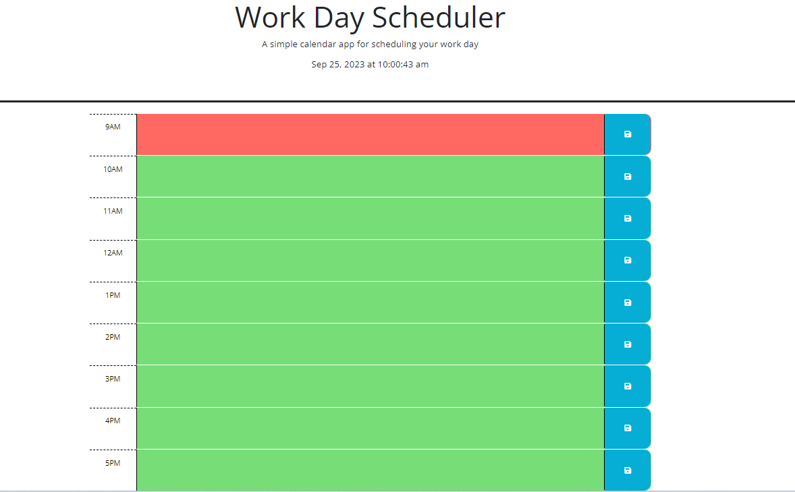

# work-day-scheduler

## Description

The work day scheduler is an interactive webpage displaying the current date and time counting down by the second. The scheduler is color coded from 9am-5pm with a text area in each time frame to write task/to-do's and save them to local storage. Once the page is refreshed the tasks that were save to local storage will appear in the time slot they were originally assigned. 

Color Key which determines the current hour as well as past and future times:
Grey: Past 
Red: Present
Green: Future

The goal of this project is to:

- Create a dynamic webpage displaying the current date and time
- Use jQuery to keep code organized and concise
- Create a running time by the second using dayjs
- Dynamically color code each hour based on past, present and future
- Save user input to local storage, upon refresh display the input 

The motivation is to create a functional day scheduler that will save information based on the user input placed into each text area. The scheduler is organized by color displaying the past, present, and future times. The ultimate goal is to create a day planner that is organized, convenient and easy to use.

## Installation

To use project locally, follow these steps:

1. Clone repository to local machine 
    - git clone https://github.com/brandonlambrecht/work-day-scheduler

2. Open 'index.html' in your web browser 

3. Click on text area and type task or to-do in time block and hit the save button. 

4. Once the page is refreshed, the input you placed will show in the corresponding time frame.

## Usage

1. See below for snap shot of work day scheduler 
Image

2. Follow deployed link for full access to
[Workday Scheduler](https://brandonlambrecht.github.io/work-day-scheduler/)